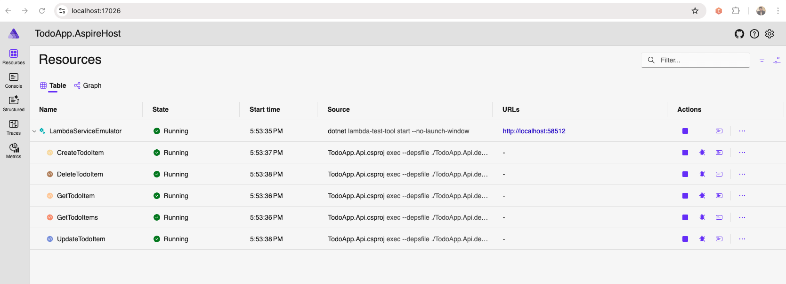

# TodoApp - AWS AppSync with .NET Lambda Direct Resolvers

This sample project demonstrates how to build a serverless GraphQL API using AWS AppSync with .NET Lambda functions as direct resolvers. The application is a simple Todo management system that showcases best practices for implementing AWS AppSync APIs with .NET Lambda functions.

## Solution Architecture
The solution uses the following AWS services:

- **AWS AppSync**: Provides the GraphQL API interface
- **AWS Lambda (.NET 8)**: Implements the business logic as direct resolvers
- **Amazon DynamoDB**: Stores the Todo items
- **AWS CDK**: Defines and deploys the infrastructure as code

## Project Structure

```
TodoApp/
├── src/
│   ├── TodoApp.Api/                    # Lambda function code
│   │   ├── Entity/                     # DynamoDB entity models
│   │   │   └── TodoItemEntity.cs       # Todo item entity for DynamoDB
│   │   ├── GraphQLTypes/               # GraphQL type definitions
│   │   │   ├── CreateTodoItem.cs       # Input type for creating todos
│   │   │   ├── Todo.cs                 # Todo type definition
│   │   │   └── UpdateTodoItem.cs       # Input type for updating todos
│   │   ├── Repository/                 # Data access layer
│   │   │   ├── ITodoRepository.cs      # Repository interface
│   │   │   └── TodoRepository.cs       # DynamoDB repository implementation
│   │   ├── Services/                   # Business logic layer
│   │   │   ├── ITodoService.cs         # Service interface
│   │   │   ├── TodoMapper.cs           # Entity to DTO mapping
│   │   │   └── TodoService.cs          # Service implementation
│   │   ├── Functions.cs                # Lambda function handlers
│   │   ├── Startup.cs                  # Dependency injection setup
│   │   ├── TodoApp.Api.csproj          # Project file
│   │
│   ├── TodoApp.AspireHost/             # .NET Aspire host project
│   │   ├── Program.cs                  # Aspire host configuration
│   │
│   └── TodoApp.Cdk/                    # CDK Infrastructure code
│       ├── graphql/                    # GraphQL schema files
│       │   └── schema.graphql          # GraphQL schema definition
│       ├── AppSyncApiStack.cs          # Main CDK stack with AppSync and Lambda resources
│       ├── Program.cs                  # CDK app entry point
│
├── tests/
│   └── TodoApp.Tests/                  # Unit tests
│       ├── TodoRepositoryTests.cs      # Repository tests
│       ├── TodoServiceTests.cs         # Service tests
```

### Key Files

- `AppSyncApiStack.cs`: Contains the CDK infrastructure definition including:
  - AppSync GraphQL API configuration
  - DynamoDB table definition
  - Lambda function definitions with appropriate IAM permissions
  - Direct Lambda resolver mappings

- `graphql/schema.graphql`: Defines the GraphQL schema with queries and mutations

- `Functions.cs`: Contains the Lambda function handlers that implement the GraphQL resolvers

- `TodoService.cs`: Implements the business logic for managing Todo items

## GraphQL API Capabilities

The API supports the following operations:

### Queries
- `getTodoById(id: ID!)`: Retrieve a specific Todo item by ID
- `listTodos`: Retrieve all Todo items

### Mutations
- `createTodo(title: String!, description: String)`: Create a new Todo item
- `updateTodo(id: ID!, title: String!, description: String, completed: Boolean!)`: Update an existing Todo item
- `deleteTodo(id: ID!)`: Delete a Todo item

## Prerequisites

- [.NET 8 SDK](https://dotnet.microsoft.com/download/dotnet/8.0) installed
- [AWS CDK CLI](https://docs.aws.amazon.com/cdk/latest/guide/getting_started.html) installed (`npm install -g aws-cdk`)
- [AWS CLI](https://aws.amazon.com/cli/) installed and configured with appropriate credentials
- [AWS Lambda .NET Global Tool](https://github.com/aws/aws-lambda-dotnet) installed (`dotnet tool install -g Amazon.Lambda.Tools`)
- An AWS account with permissions to create the required resources

## Setup and Deployment

### 1. Clone the repository

```bash
git clone https://github.com/aws-samples/sample-appsync-dotnet-lambda-resolvers.git
cd sample-appsync-dotnet-lambda-resolvers
```

### 2. Build the .NET Lambda functions

```bash
cd src/TodoApp.Api
dotnet lambda package
cd ../..
```

### 3. Deploy the CDK stack

#### Option 1: API Key Authentication (Default)
```bash
cdk bootstrap  # Only needed the first time you use CDK in an account/region
cdk deploy
```

#### Option 2: Lambda Authorization
```bash
cdk bootstrap  # Only needed the first time you use CDK in an account/region
cdk deploy -c useLambdaAuth=true
```

The deployment will output the GraphQL API URL and either an API Key or authorization type based on your choice.

## Testing the API

You can test the API using the AWS AppSync Console or any GraphQL client like [Postman](https://www.postman.com/) or [Insomnia](https://insomnia.rest/).

You can test your API using popular API clients like Thunder Client or Postman:

#### For API Key Authentication:
1. **Configure your request headers:**
   - `x-api-key`: Your AppSync API key
   - `Content-Type`: application/json

#### For Lambda Authorization:
1. **Configure your request headers:**
   - `Authorization`: Bearer valid-token (or Bearer admin-token)
   - `Content-Type`: application/json

2. **Set the endpoint URL** to your AppSync API URL

3. **Write your GraphQL queries or mutations** in the request body

4. **Send the request and examine the response**

### Example Queries

#### List all Todo items
```graphql
query ListTodos {
  listTodos {
    id
    title
    description
    completed
    createdAt
    updatedAt
  }
}
```

#### Get a specific Todo item
```graphql
query GetTodo {
  getTodoById(id: "your-todo-id") {
    id
    title
    description
    completed
    createdAt
    updatedAt
  }
}
```

#### Create a new Todo item
```graphql
mutation CreateTodo {
  createTodo(
    title: "Complete AWS AppSync sample"
    description: "Finish the AppSync with .NET Lambda sample project"
  ) {
    id
    title
    description
    completed
    createdAt
  }
}
```

## Authorization Options

This project supports two authentication methods:

### API Key Authentication (Default)
- Simple API key-based authentication
- Suitable for development and testing
- Use `x-api-key` header with requests

### Lambda Authorization
- Custom Lambda function validates requests
- Supports Bearer token authentication
- Deploy with `-c useLambdaAuth=true`
- Test tokens: `valid-token` or `admin-token`

## Security

The project implements several security best practices:

1. **Least Privilege Permissions**: Each Lambda function has only the permissions it needs
2. **API Key Authentication**: The GraphQL API is protected with an API key
3. **Resource Policies**: Resources are configured with appropriate access controls

## Local Testing with .NET Aspire

This project includes a .NET Aspire host project (`TodoApp.AspireHost`) that allows you to test your Lambda functions locally.

### Running Locally

1. Navigate to the Aspire host project directory:
   ```bash
   cd src/TodoApp.AspireHost
   ```

2. Run the Aspire host project:
   ```bash
   dotnet run
   ```

3. This will launch the .NET Aspire dashboard in your browser, where you can:
   - Monitor your local Lambda function executions
   - View logs and performance metrics
   - Test your Lambda functions with sample events

   


For more detailed information about building Lambda functions with .NET Aspire, refer to the AWS blog post: [Building Lambda with Aspire](https://aws.amazon.com/blogs/developer/building-lambda-with-aspire-part-1/)

## Clean Up

To avoid incurring future charges, delete the stack:

```bash
cdk destroy
```

## Additional Resources
- [Amazon.Lambda.AppSyncEvents NuGet package](https://www.nuget.org/packages/Amazon.Lambda.AppSyncEvents)
- [AWS AppSync Developer Guide](https://docs.aws.amazon.com/appsync/latest/devguide/welcome.html)
- [AWS Lambda .NET Developer Guide](https://docs.aws.amazon.com/lambda/latest/dg/lambda-csharp.html)
- [AWS CDK Developer Guide](https://docs.aws.amazon.com/cdk/latest/guide/home.html)
- [AWS Lambda Annotations for .NET](https://github.com/aws/aws-lambda-dotnet/tree/master/Libraries/src/Amazon.Lambda.Annotations)

## Security

See [CONTRIBUTING](CONTRIBUTING.md#security-issue-notifications) for more information.

## License

This library is licensed under the MIT-0 License. See the LICENSE file.

